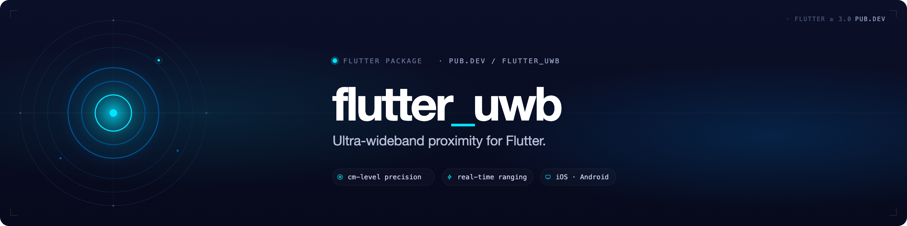
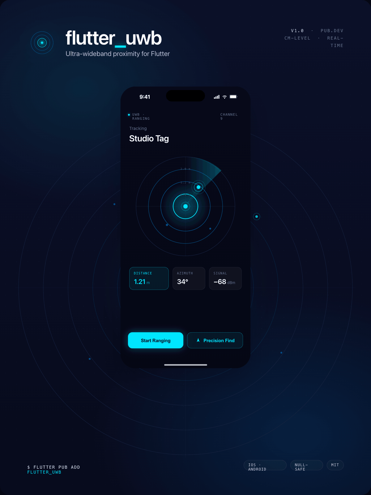
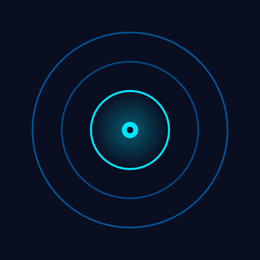

<p align="center">
  
</p>

<p align="center">
  
  <a href="https://pub.dev/packages/flutter_uwb"></a>
  <a href="https://pub.dev/packages/flutter_uwb/score"></a>
  
  <a href="LICENSE"></a>
</p>

<p align="center">
  <b>Ultra-wideband proximity for Flutter — cm-level distance, real-time ranging, Precision Find.</b>
</p>

<p align="center">
  
</p>

##  Features

- **Distance + direction** — sub-10 cm distance and azimuth/elevation when the hardware supports it.
- **No signalling server** — peers find each other over BLE; the plugin handles the UWB token exchange.
- **One API, two platforms** — same Dart surface for Android (`androidx.core.uwb`) and iOS (`NearbyInteraction`).
- **Apple FiRa accessories** — talk to Qorvo, NXP and other certified tags out of the box.
- **End-to-end encrypted** — Android↔Android sessions are keyed by an X25519 ECDH handshake over BLE OOB.
- **Streams everywhere** — discovery, ranging samples, errors, and lifecycle events as `Stream`s you can plug into any state-management solution.

## Platform support

| Platform    | Minimum hardware                                                            | Notes                                                                                       |
| ----------- | --------------------------------------------------------------------------- | ------------------------------------------------------------------------------------------- |
| **Android** | Pixel 6 Pro+, Galaxy S21 Ultra+, or any device exposing `FEATURE_UWB`        | Accessory/controlee mode requires Pixel 7 Pro+ on Android 14+.                              |
| **iOS**     | iPhone with U1/U2 chip (iPhone 11+, excluding SE 2/3) on iOS 16+             | Camera assist & extended distance gated by `RangingOptions`. iOS 14/15 hosts must pin to 0.3.1. |

`isUwbAvailable()` returns `false` on emulators, the iOS simulator, and devices without a UWB chip — always check it before calling discovery.

> **iOS 26 / U2 chip caveat.** Apple disabled `supportsDirectionMeasurement` for the U2 chip on iOS 26, so iPhone 15 Pro / Pro Max and the iPhone 16 series report `null` for `azimuthDegrees` and `elevationDegrees`. Distance is unaffected.

> **Cross-OS (iPhone ↔ Android) is experimental in 0.4.0.** BLE handshake and Android UWB session activation complete, but `androidx.core.uwb` rejects the slot duration Apple selects, so stable distance samples are not yet delivered. Same-OS pairs (iOS↔iOS, Android↔Android) are stable. iPhones are auto-discovered on Android and vice-versa — no `registerAccessoryProfile` boilerplate is needed for cross-OS.

## Installation

```bash
flutter pub add flutter_uwb
```

> Requires Flutter `>=3.22` and Dart `>=3.3`.

## Quick start

Both peers run the same code. Pick a unique `localName` for each side.

```dart
import 'package:flutter_uwb/flutter_uwb.dart';

final uwb = FlutterUwb.instance;

if (!await uwb.isUwbAvailable()) return;

await uwb.startDiscovery('phone-A');

uwb.deviceFound.listen((device) async {
  await uwb.pairWith(device.id);     // exchanges UWB tokens
  await uwb.startRanging(device.id); // begin streaming samples
});

uwb.rangingSamples.listen((s) {
  print('${s.distanceMeters.toStringAsFixed(2)} m  '
        '${s.azimuthDegrees?.toStringAsFixed(1)}°');
});
```

When you're done:

```dart
await uwb.stopRanging();
await uwb.stopDiscovery();
```

> **Both** peers must call `pairWith` before either calls `startRanging`. Trigger this from your own UI (a button, a QR scan, a server event — whatever fits).

A complete runnable demo lives in [`example/`](example/).

## API

| Stream            | Fires when                                                |
| ----------------- | --------------------------------------------------------- |
| `deviceFound`     | A new peer is discovered via BLE                          |
| `deviceLost`      | A previously-discovered peer disappears                   |
| `rangingSamples`  | A new `RangingSample` arrives from the active session     |
| `peerLost`        | The ranging peer disconnects mid-session                  |
| `rangingErrors`   | A platform error occurs inside the active session         |
| `sessionState`    | Aggregate `idle → discovering → pairing → ranging` view   |

`RangingSample` exposes `distanceMeters`, `azimuthDegrees`, `elevationDegrees`, `elapsedRealtimeNanos` and the originating `deviceId`. All mutating methods throw `UwbException` on failure.

`startRanging` accepts an optional `RangingOptions(cameraAssist, extendedDistance)` for iOS opt-ins. Use `getDeviceCapabilities()` to gate the toggles in your UI.

For accessory mode (Qorvo, NXP, third-party FiRa tags), use `registerAccessoryProfile(serviceUuid, rxUuid, txUuid, vendorTag)`. iPhones running `flutter_uwb` are auto-discovered on Android without this step.

Full API docs: <https://pub.dev/documentation/flutter_uwb/latest/>

## Permissions

<details>
<summary><b>Android</b></summary>

The plugin manifest already declares the required `<uses-permission>` entries. Your app only needs to **request** them at runtime:

| API level | Runtime permissions                                                              |
| --------- | -------------------------------------------------------------------------------- |
| 31+       | `BLUETOOTH_SCAN`, `BLUETOOTH_ADVERTISE`, `BLUETOOTH_CONNECT`                      |
| ≤ 30      | `ACCESS_FINE_LOCATION`                                                           |
| 33+       | additionally `UWB_RANGING`                                                       |

```kotlin
import android.Manifest
import android.os.Build
import androidx.core.app.ActivityCompat

private val perms: Array<String> = buildList {
  if (Build.VERSION.SDK_INT >= Build.VERSION_CODES.S) {
    add(Manifest.permission.BLUETOOTH_SCAN)
    add(Manifest.permission.BLUETOOTH_ADVERTISE)
    add(Manifest.permission.BLUETOOTH_CONNECT)
  } else {
    add(Manifest.permission.ACCESS_FINE_LOCATION)
  }
  if (Build.VERSION.SDK_INT >= Build.VERSION_CODES.TIRAMISU) {
    add(Manifest.permission.UWB_RANGING)
  }
}.toTypedArray()

ActivityCompat.requestPermissions(this, perms, /*requestCode*/ 1)
```
</details>

<details>
<summary><b>iOS</b></summary>

Add to `ios/Runner/Info.plist`:

```xml
<key>NSNearbyInteractionUsageDescription</key>
<string>Used to measure precise distance to nearby devices over UWB.</string>

<key>NSBluetoothAlwaysUsageDescription</key>
<string>Used to discover nearby devices for UWB ranging.</string>

<!-- Required for iOS↔iOS pairing on iOS 17+ (keeps the AWDL sidechannel alive). -->
<key>NSLocalNetworkUsageDescription</key>
<string>Used to coordinate UWB ranging with nearby iPhones.</string>
<key>NSBonjourServices</key>
<array>
  <string>_flutteruwb-uwb._tcp</string>
  <string>_flutteruwb-uwb._udp</string>
</array>
```

The Bonjour service names must match exactly. If you only target Android peers or FiRa accessories, the local-network keys are optional but harmless.
</details>

## Example app

A runnable cross-platform demo lives in [`example/`](example/). It wires up discovery, pairing, and a live distance/azimuth readout for both same-OS and cross-OS pairs.

## Architecture

For protocol details, token format, BLE/UWB topology, the ECDH-keyed Provisioned STS handshake, and the cross-OS capability-flag routing matrix, see [`doc/architecture.md`](doc/architecture.md).

## License

[MIT](LICENSE)
